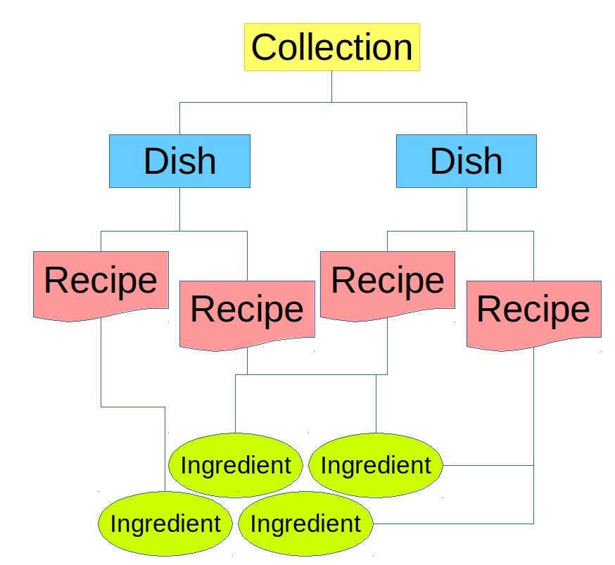
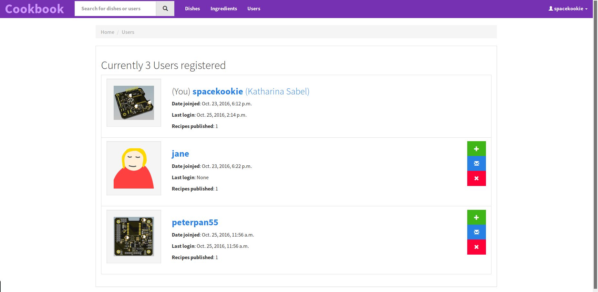
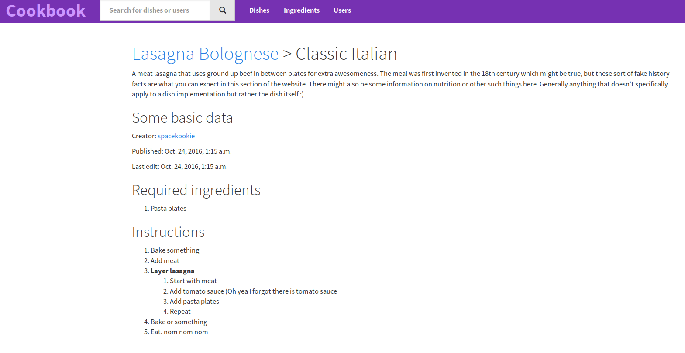

# Cookbook

A modern cooking platform for the 21st century. Well-defined recipe hirarchies and structures, machine-parsible instructions and searchable ingredient tags.

The current website is in a very early development state. It probably contains a lot of bugs and is missing a lot of features. Currently it is possible to test the website with the included database.

You need django installed to run this website. In case you do, simple run

```console
$> python manage.py runserver
```

Following is a rough structure of how cookbook organises recipies.




## Some screenshots from an early state website




